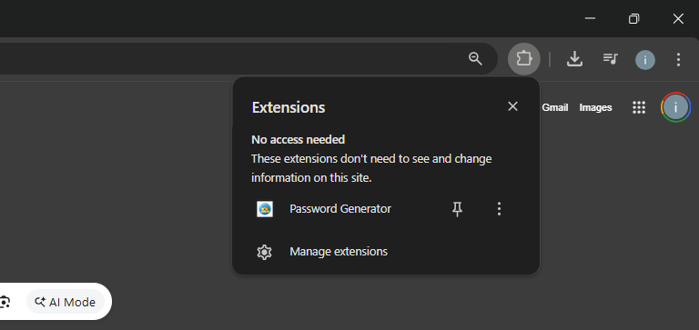
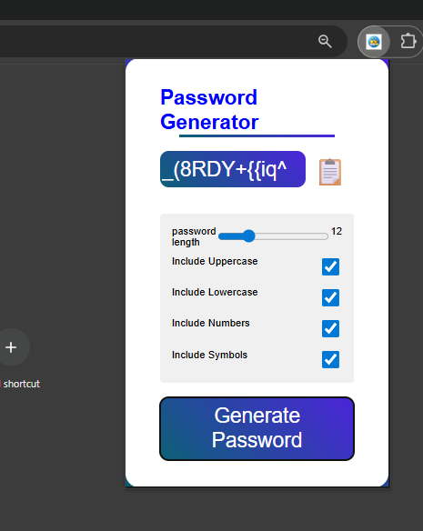

# 🔐 Password Generator Chrome Extension

A simple and secure Chrome extension that generates strong passwords
based on user-selected rules such as length, uppercase, lowercase,
numbers, and symbols.

---

## ✨ Features

- Adjustable password length (8–24 characters)
- Include / exclude:
  - Uppercase letters
  - Lowercase letters
  - Numbers
  - Symbols
- One-click password generation
- Copy password to clipboard
- Clean and responsive UI
- Built using Chrome Manifest V3

---

## 📸 Screenshots

---

## 🛠️ Tech Stack

- HTML
- CSS
- JavaScript
- Chrome Extensions API (Manifest V3)

---

## 🚀 How to Run Locally (Free)

1. Clone this repository or download ZIP
2. Open Google Chrome
3. Go to `chrome://extensions`
4. Enable **Developer Mode**
5. Click **Load unpacked**
6. Select the project folder

The extension will appear in the Chrome toolbar.

---

## 📁 Project Structure

password-generator-chrome-extension/ 
├── icons/ 
├── screenshots/ 
├── index.html 
├── style.css 
├── script.js 
├── manifest.json 
└── README.md 

---

## 🔒 Privacy Policy

This extension does **not** collect, store, or transmit any user data. 
All password generation happens locally in the browser.

---

## 📌 Future Improvements

- Password strength meter
- Cryptographically secure randomness
- Dark mode
- Auto-copy toggle

---

## 👨‍💻 Author

Built by an IT engineering student. 
